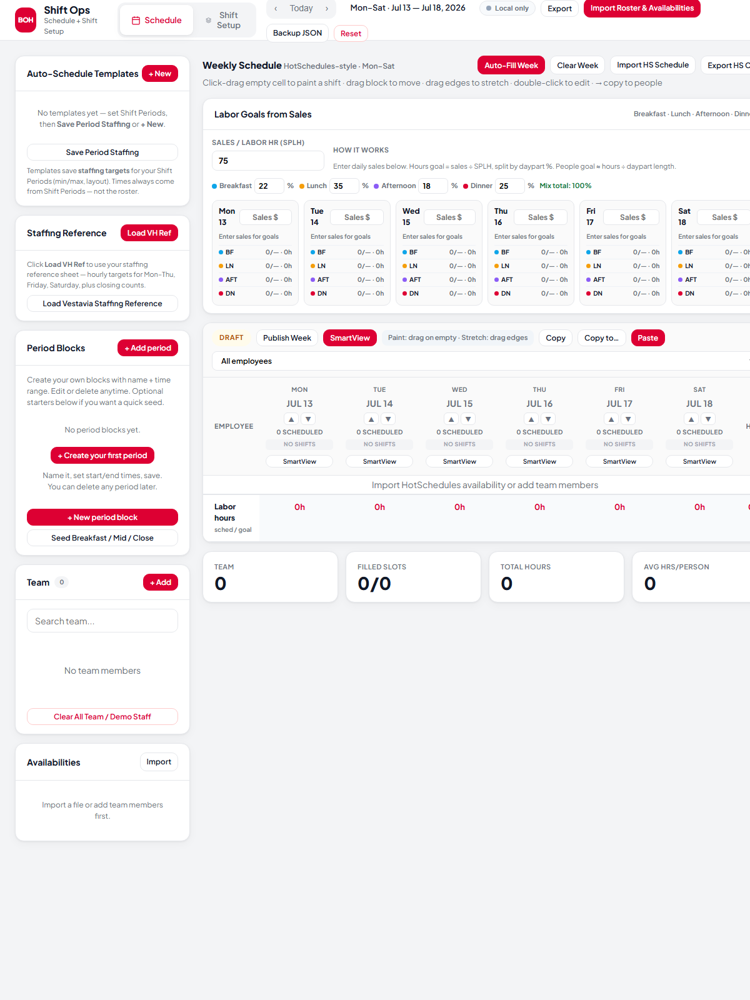
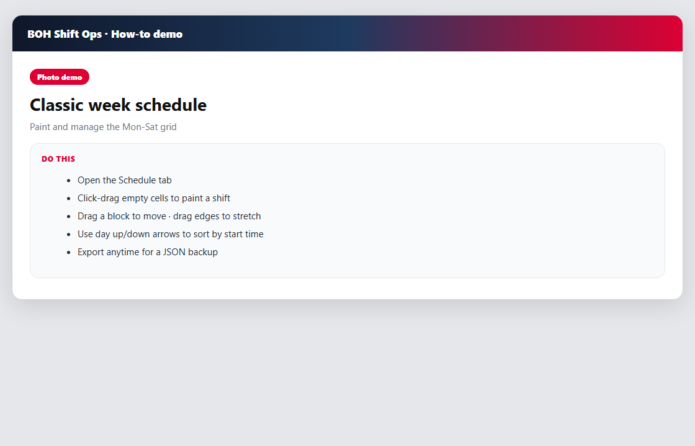
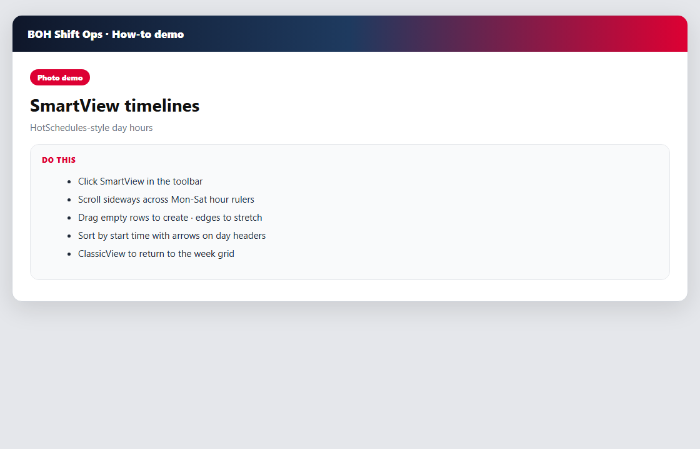
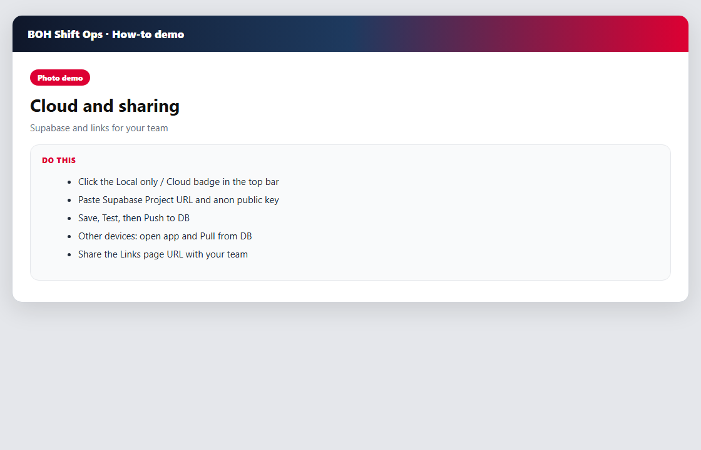

# BOH Shift Ops — How to use (with photo demos)

**Chick-fil-A Vestavia Hills · Back of House**

This guide explains how to run the schedule app, SmartView, period blocks, positions/handovers, and cloud sync.

---

## Always-handy links (share these)

| What | Link |
|------|------|
| **Share hub (bookmark this)** | https://roudic.github.io/boh-shift-ops/guide/ |
| **Live app** | https://roudic.github.io/boh-shift-ops/ |
| **GitHub repo** | https://github.com/Roudic/boh-shift-ops |
| **This full how-to** | https://roudic.github.io/boh-shift-ops/guide/HOW-TO.md |
| **Supabase SQL** | https://github.com/Roudic/boh-shift-ops/blob/master/supabase-schema.sql |
| **Supabase dashboard** | https://supabase.com/dashboard |
| **Your Table Editor** | https://supabase.com/dashboard/project/oikrcoccaepgtvdswuuo/editor |

**Tip:** Send teammates only the **Share hub** link. Everything they need is one click from there.

---

## 1. Open the app



1. Go to the [live app](https://roudic.github.io/boh-shift-ops/).
2. Top bar has **Schedule** and **Shift Setup**.
3. Use week arrows to change weeks.
4. **Export** downloads a full JSON backup of your setup.

Local file (this PC only): `C:\Users\vinzi\boh-shift-app\index.html`  
Note: local file and the live site store data separately unless you Export/Import or use Cloud.

---

## 2. Classic week schedule (paint shifts)



1. Stay on the **Schedule** tab.
2. **Click-drag** an empty cell to paint a shift.
3. **Drag the block** to move times; **drag left/right edges** to stretch.
4. Under a day header, use **▲** (earliest start first) or **▼** (latest first).
5. Double-click a shift for the full time editor.
6. **Export** anytime for a JSON backup of periods, team, schedule, and positions.

---

## 3. SmartView (hour timelines)



1. Click **SmartView** in the toolbar (or a day → SmartView).
2. Scroll sideways across **Mon–Sat** with hour marks (4:00 AM–11:00 PM).
3. Drag empty rows to create; drag edges to stretch; drag middle to move.
4. Use **▲ / ▼** on each day header to sort the team by that day’s start time.
5. Footer shows **Employees / Hours / Productivity** by hour (productivity needs daily sales).
6. **ClassicView** or **Esc** returns to the week grid.

---

## 4. Period blocks & positions


### Period blocks (your coverage windows)

1. Schedule sidebar → **Period Blocks**.
2. **+ Add period** → name + start/end + color → Save.
3. **Edit** or **Delete** any period anytime.
4. Optional seed is only a starter — you own every block.

### Positions (station board)

1. Open **Shift Setup**.
2. Pick **day** + **period**.
3. **Edit Positions** → build groups (Primary, Machines, etc.) and positions.
4. Check **every period** that should share that board → **Save to N periods**.
5. Drag people from the pool onto a station; set **from / until** times.
6. For handovers: same station → **+ Add person / handover**  
   Example: Alex **5:00a–3:00p**, then Sam **3:00p–close**.

---

## 5. Cloud database (Supabase)



### One-time setup

1. Supabase → **SQL Editor** → run [`supabase-schema.sql`](https://github.com/Roudic/boh-shift-ops/blob/master/supabase-schema.sql).
2. **Settings → API** → copy Project URL + **anon public** key.
3. Live app → click **Local only** badge (top bar).
4. Paste URL + key · Store id = `default`.
5. **Save connection** → **Test** → **Push to DB**.

**This project’s URL format:**

```text
https://oikrcoccaepgtvdswuuo.supabase.co
```

(Keep the anon key private — only paste it in the app.)

### Day-to-day

| Action | Where |
|--------|--------|
| Auto-save to cloud | After connect — saves push in the background |
| Force upload | Cloud badge → **Push to DB** |
| Load on another device | Open app → Cloud badge → **Pull from DB** |
| See raw data | Supabase **Table Editor** → `boh_app_state` |

---

## 6. Moving data between local file and live site

1. Open **local** `index.html` → **Export** → save JSON.
2. Open **live** site → **Backup JSON** import → choose that file.
3. Cloud badge → **Push to DB**.

---

## Troubleshooting

| Problem | Fix |
|---------|-----|
| No cloud badge | Hard refresh (**Ctrl+F5**); widen the window |
| SQL error | Use the simplified `supabase-schema.sql` from the repo |
| Only Project ID | URL = `https://PROJECT_ID.supabase.co` |
| Empty cloud row | Click **Push** after connecting |
| Two people overwrote each other | Pull before big edits; last push wins |

---

## What to send new leaders

Just this one link:

**https://roudic.github.io/boh-shift-ops/guide/**

They get the app, GitHub, photos, and cloud links on one page.
